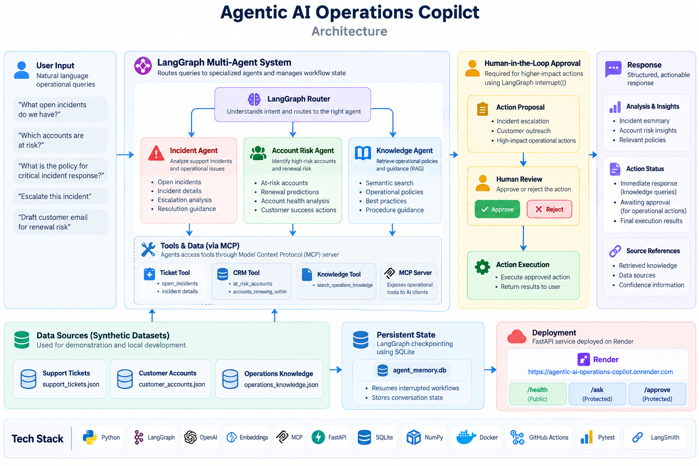

# Agentic AI Operations Copilot

[](https://github.com/Rishika73/agentic-ai-operations-copilot/actions/workflows/tests.yml)

A production-oriented multi-agent AI system for operational support, incident analysis, account risk detection, and internal knowledge retrieval.

The platform uses LangGraph for agent orchestration, OpenAI for reasoning and embeddings, FastAPI for serving workflows, MCP for tool access, SQLite checkpointing for resumable state, and human approval gates for higher-impact actions.

---

## Live Deployment

The FastAPI service is deployed on Render.

**Service Status:**  
[agentic-ai-operations-copilot.onrender.com](https://agentic-ai-operations-copilot.onrender.com)

The service status endpoint returns:

```json
{
  "service": "Agentic AI Operations Copilot",
  "status": "running"
}
```

**Interactive API Documentation:**  
[Open Swagger UI](https://agentic-ai-operations-copilot.onrender.com/docs)

The Swagger UI exposes the available API endpoints:

```text
GET  /
GET  /health
POST /ask
POST /approve
```

The `/ask` and `/approve` endpoints are protected with an `X-API-Key` header.

> The free Render instance may take a few seconds to wake after a period of inactivity.

---

## What This Project Does

The system routes operational questions to specialized agents and combines structured tools, semantic retrieval, workflow state, and approval-aware execution.

Current use cases include:

- Incident analysis
- Customer and account risk
- Operations knowledge retrieval
- Policy lookup
- Action proposal
- Human approval before higher-impact execution

---

## Architecture



The workflow starts with a natural-language operational request, routes it through a LangGraph agent graph, retrieves the necessary context or tools, and either returns a response immediately or pauses for human approval before executing a higher-impact action.

---

## Multi-Agent Workflow

LangGraph routes each request to one of three specialized agents.

### Incident Agent

Analyzes active support incidents and operational issues.

```text
incident_agent
```

Typical responsibilities include:

- Reviewing open incidents
- Summarizing incident details
- Identifying escalation needs
- Providing resolution guidance

### Account Risk Agent

Identifies high-risk customer accounts and potential renewal issues.

```text
account_risk_agent
```

Typical responsibilities include:

- Identifying at-risk accounts
- Reviewing renewal risk
- Evaluating customer health
- Proposing customer-success actions

### Knowledge Agent

Retrieves internal policies and operational guidance using semantic search.

```text
knowledge_agent
```

Typical responsibilities include:

- Policy lookup
- Operational guidance
- Best-practice retrieval
- Procedure search

---

## Semantic RAG

The knowledge agent uses OpenAI embeddings and cosine similarity to retrieve relevant internal guidance.

Embedding model:

```text
text-embedding-3-small
```

This allows the system to retrieve useful operational knowledge even when the wording of a user query differs from the source material.

The current implementation uses an in-process embedding index over the demonstration knowledge dataset.

---

## Model Context Protocol

The project includes a working Model Context Protocol server that exposes operational tools to AI clients.

Available MCP tools:

```text
open_incidents
at_risk_accounts
accounts_renewing_within
search_operations_knowledge
```

The MCP server has been tested using MCP Inspector.

Start it locally with:

```bash
PYTHONPATH=. python -u mcp_server.py
```

Inspect the server with:

```bash
mcp dev mcp_server.py
```

---

## Human-in-the-Loop Approval

Higher-impact workflows require explicit human approval before execution.

Examples include:

- Incident escalation
- Customer-success outreach

LangGraph `interrupt()` pauses the workflow and returns an approval request.

The workflow can later resume using the same `thread_id`.

Knowledge-only requests do not require approval and can return immediately.

---

## Persistent Workflow State

LangGraph checkpointing is backed by SQLite:

```text
agent_memory.db
```

This allows interrupted workflows to resume from stored state instead of restarting from the beginning.

The checkpoint layer stores workflow state associated with the conversation thread.

Runtime database files are excluded from Git.

---

## FastAPI Service

Start the API locally:

```bash
PYTHONPATH=. uvicorn app.main:app --reload
```

Available endpoints:

```text
GET  /
GET  /health
POST /ask
POST /approve
```

Example authenticated request:

```bash
curl -X POST http://127.0.0.1:8000/ask \
  -H "Content-Type: application/json" \
  -H "X-API-Key: your_app_api_key_here" \
  -d '{"query":"What open incidents do we have?"}'
```

Requests that require approval return:

```text
status: awaiting_approval
```

The workflow can then be resumed through `/approve` using the returned `thread_id`.

---

## Project Structure

```text
agentic-ai-operations-copilot/
├── agents/
│   ├── incident_agent.py
│   ├── account_risk_agent.py
│   └── knowledge_agent.py
├── app/
│   ├── actions.py
│   ├── agent_graph.py
│   ├── llm.py
│   ├── main.py
│   └── state.py
├── tools/
│   ├── crm_tool.py
│   ├── ticket_tool.py
│   └── knowledge_tool.py
├── data/
│   ├── customer_accounts.json
│   ├── operations_knowledge.json
│   └── support_tickets.json
├── tests/
│   ├── test_actions.py
│   ├── test_agent_graph.py
│   ├── test_api.py
│   └── test_knowledge_tool.py
├── evals/
├── docs/
│   ├── agent_routing_demo.png
│   └── agentic-ai-operations-copilot-architecture.png
├── .github/
│   └── workflows/
│       └── tests.yml
├── mcp_server.py
├── Dockerfile
├── .dockerignore
├── .env.example
├── .gitignore
├── requirements.txt
├── LICENSE
└── README.md
```

---

## Local Setup

Create and activate a virtual environment:

```bash
python3 -m venv .venv
source .venv/bin/activate
```

Install dependencies:

```bash
python -m pip install -r requirements.txt
```

Create your local environment file:

```bash
cp .env.example .env
```

Add your OpenAI API key and application API key to `.env`:

```text
OPENAI_API_KEY=your_openai_api_key_here
APP_API_KEY=your_app_api_key_here
```

Do not commit `.env`.

---

## Run the CLI

```bash
PYTHONPATH=. python -u app/agent_graph.py
```

Example prompts:

```text
What open incidents do we have?
Which customer accounts are at risk?
What is the policy for critical incident response?
```

---

## Docker

Build the image:

```bash
docker build -t agentic-ai-operations-copilot .
```

Run the container:

```bash
docker run --rm -it \
  --env-file .env \
  agentic-ai-operations-copilot
```

---

## Testing

Run the full test suite:

```bash
PYTHONPATH=. python -m pytest -q
```

Current verified result:

```text
19 passed
```

Test coverage includes:

- Agent routing
- Human approval behavior
- Safe action execution
- Semantic knowledge retrieval
- Similarity scoring
- Top-k retrieval
- FastAPI health checks
- `/ask` workflow
- `/approve` workflow

---

## CI/CD

GitHub Actions runs the test suite automatically on pushes and pull requests to `main`.

This provides automated validation for:

- Agent workflow behavior
- Retrieval logic
- Human approval flow
- FastAPI endpoints
- Application changes before integration

The current workflow status is shown by the test badge at the top of this README.

---

## Observability & Performance

LangSmith tracing is integrated to inspect LangGraph execution paths, node-level latency, and human-in-the-loop workflows.

Tracing showed that the LLM synthesis step was the main contributor to incident-response latency.

Observed incident workflow latency:

```text
Before prompt optimization:
Total workflow: 19.10s
LLM synthesis: 18.98s

After prompt optimization:
Total workflow: 9.66s
LLM synthesis: 9.46s
```

Prompt simplification reduced observed workflow latency by roughly 50% in this test while preserving workflow behavior.

LangSmith traces capture:

- Router execution
- Specialized agent execution
- Action proposals
- Human approval interrupts
- Resume after approval
- Final action execution

---

## Tech Stack

### AI & Orchestration

- LangGraph
- OpenAI API
- OpenAI Embeddings
- Model Context Protocol

### Backend

- FastAPI
- Python

### State & Retrieval

- SQLite
- NumPy
- Semantic similarity search

### Engineering

- Docker
- Pytest
- GitHub Actions
- LangSmith

---

## Current Scope

The project currently uses synthetic JSON datasets for incidents, customer accounts, and operational knowledge.

Semantic retrieval uses an in-process embedding index suitable for the current demonstration dataset.

Operational actions are simulated through structured responses. The project does not directly modify production systems or contact real customers.

---

## Future Improvements

- Persistent vector database
- Hybrid retrieval
- Reranking
- Larger evaluation suite
- External operational-system integrations
- Additional production observability
